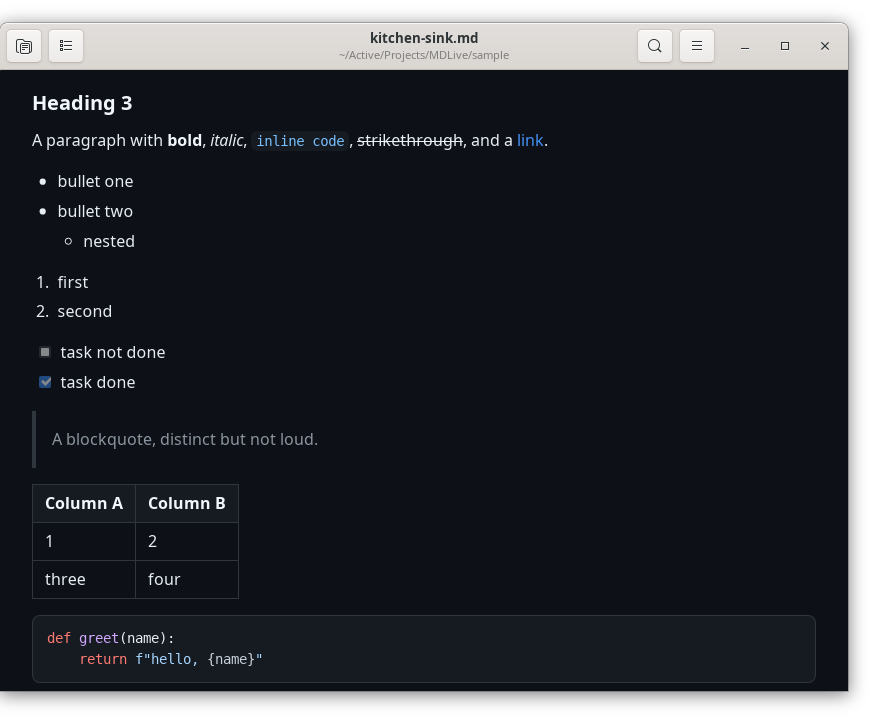
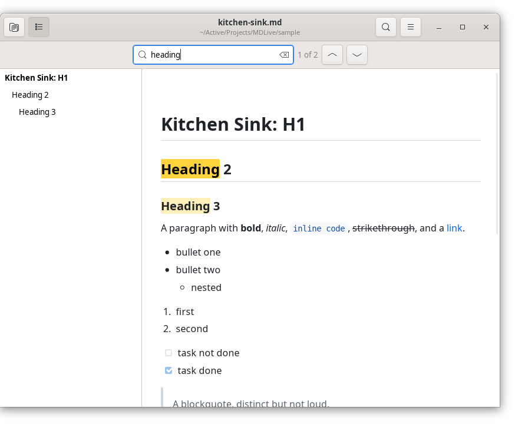
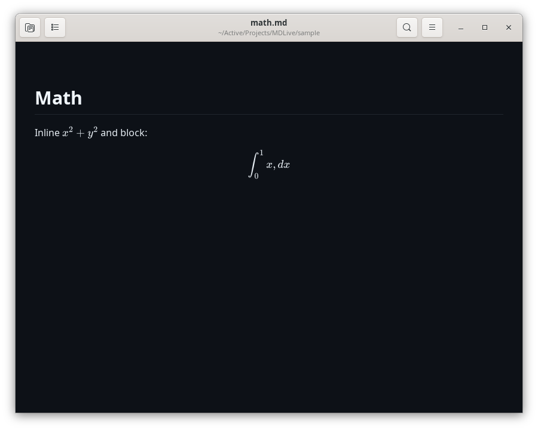
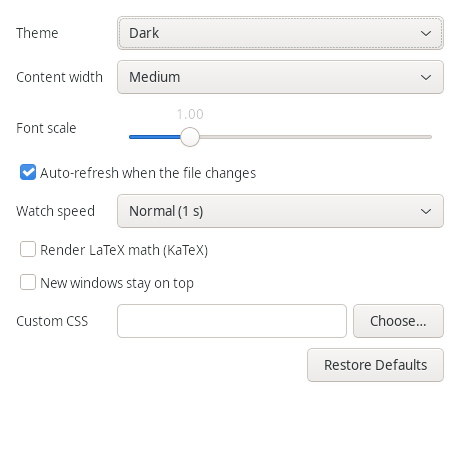

# MDLive

### [Install on macOS](#macos) &nbsp;·&nbsp; [Install on Linux](#linux)

A small Markdown previewer that re-renders the moment the file changes on disk.

It was built for working next to AI coding agents. When Claude Code or Codex
edits a `.md` file, you see the new version straight away without touching
anything. There is no editor, no vault, and no server. It opens a file and shows
it.

<table>
  <tr>
    <td width="50%"><a href="docs/images/thumb-dark.png"></a></td>
    <td width="50%"><a href="docs/images/thumb-light-outline.png"></a></td>
  </tr>
  <tr>
    <td width="50%"><a href="docs/images/thumb-math.png"></a></td>
    <td width="50%"><a href="docs/images/thumb-settings.png"></a></td>
  </tr>
</table>

## What it does

- Re-renders on every save, including atomic saves where the editor writes a
  temp file and renames it over the original
- Keeps your scroll position across refreshes, so the page does not jump
- Syntax highlighting for fenced code blocks
- GitHub style tables, task lists, footnotes, definition lists, strikethrough
- LaTeX math with KaTeX, off by default, works offline
- Dark and light themes, font zoom, and an adjustable content width
- Find, with a match count
- An outline sidebar built from the document headings
- Print, plus export to PDF or self contained HTML
- Keep the window on top, so it can sit beside your editor
- One window per file, and re-opening a file focuses the window it is in already
- Fully offline. Nothing is fetched at runtime and nothing is reported anywhere.

## Linux

Needs Python 3, GTK 3 and WebKit2GTK, which most desktops already have:

```
sudo apt install python3-gi gir1.2-gtk-3.0 gir1.2-webkit2-4.1
```

Then install into `~/.local`, no root required:

```
git clone https://github.com/partypancake8/MDLive.git
cd MDLive/linux
./install.sh
```

That puts `mdlive` on your PATH, adds a desktop entry, and makes MDLive the
default opener for `.md` files. Use `./install.sh --no-default` to leave your
current default alone, and `./install.sh --uninstall` to remove it.

```
mdlive README.md
```

### Shortcuts

| Action | Key |
| --- | --- |
| Open | `Ctrl+O` |
| Refresh | `Ctrl+R` |
| Find | `Ctrl+F` |
| Find next, find previous | `Ctrl+G`, `Ctrl+Shift+G` |
| Zoom in, out, reset | `Ctrl++`, `Ctrl+-`, `Ctrl+0` |
| Outline sidebar | `Ctrl+Alt+1` |
| Keep on top | `Ctrl+Shift+T` |
| Copy file path | `Ctrl+L` |
| Print | `Ctrl+P` |
| Settings | `Ctrl+,` |

## macOS

The Mac version is a native Swift app built on AppKit and WKWebView. Build it
with [XcodeGen](https://github.com/yonaskolb/XcodeGen):

```
brew install xcodegen
cd MDLive
xcodegen generate
xcodebuild -project MDLive.xcodeproj -scheme MDLive -configuration Debug \
  CODE_SIGNING_ALLOWED=NO -derivedDataPath build/dd build
cp -R build/dd/Build/Products/Debug/MDLive.app /Applications/MDLive.app
open -a MDLive sample/hello.md
```

Install to `/Applications` and launch it by name. Running `open -a` against the
raw DerivedData path fails with Launch Services error -600.

The shortcuts match the table above with Command in place of Control, so Open is
`⌘O` and the outline is `⌥⌘1`.

The Mac build is ad hoc signed for local use. Developer ID signing and
notarization are not set up, so the Sparkle update plumbing is wired in but
inert.

## How it works

Both versions share the same renderer. `MDLive/Resources/web/` holds
markdown-it, highlight.js and KaTeX, all vendored and pinned, and `index.html`
defines the entire contract: a `render()` function, a `ready` handshake, and a
few message handlers for links, the outline and scroll position.

The native side of each app is only a shell around that:

| | macOS | Linux |
| --- | --- | --- |
| Windows and menus | AppKit | GTK 3 |
| Web view | WKWebView | WebKit2GTK |
| File watching | FSEvents | GIO file monitor |
| Language | Swift | Python |

Both web views are WebKit, so the Linux port uses the web assets byte for byte
with no changes, including the `window.webkit.messageHandlers` bridge and the
custom `mdlive-img://` scheme that serves local images. Images are only served
from the directory holding the open file, so a document cannot pull in files
from elsewhere on disk.

The watcher monitors the parent directory rather than the file itself, because
an atomic save replaces the inode and would break a watch on the file. Changes
are debounced by 150 ms and only applied once the size and modification time
stop moving, which avoids rendering a half written file. A slow poll runs
alongside as a fallback.

## Development

```
linux/mdlive.py --selftest
```

The selftest renders fixtures in a real offscreen WebKit view and reads the
resulting DOM back, checking headings, bold text, syntax highlighting,
blockquotes, tables, the outline, find and HTML export. It also covers the image
path validation and the error strings. It exits non zero on failure.

The Mac side has an equivalent harness plus XCTest suites:

```
MDLIVE_SELFTEST=/tmp/out.json MDLIVE_OPEN="$PWD/sample/hello.md" \
  /Applications/MDLive.app/Contents/MacOS/MDLive
```

`sample/` holds the fixtures, including `kitchen-sink.md`, which exercises every
supported element.

## Project docs

- [`PRD.md`](docs/PRD.md) and [`PRD-v2.md`](docs/PRD-v2.md) for the specs
- [`PROGRESS.md`](docs/PROGRESS.md) for build status
- [`CHANGELOG.md`](CHANGELOG.md) for what landed when
