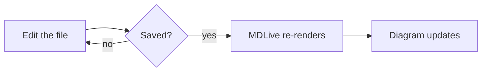
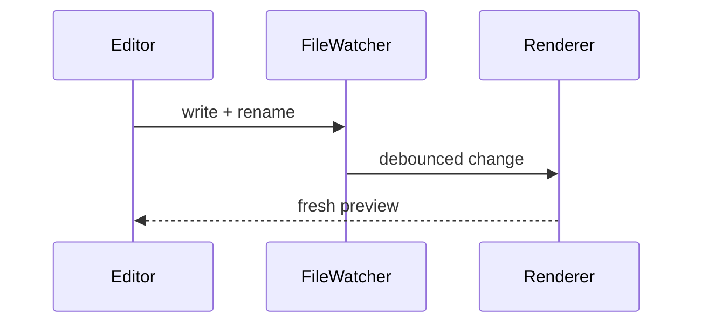
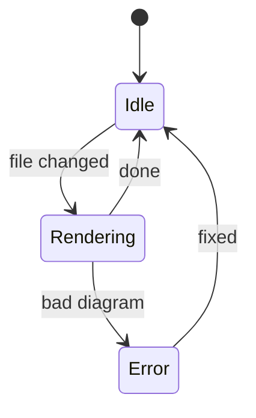

# Mermaid

Diagrams in fenced `mermaid` blocks render to SVG, bundled and offline. They
follow the Dark / Light theme and re-render on every save.

## Flowchart



## Sequence



## State



## Broken on purpose

A diagram that fails to parse shows the source with an error line above it
instead of a blank area:

```mermaid
flowchart LR
  A --> B
  this is not valid mermaid ((( )))
```

Ordinary code is untouched:

```python
print("still highlighted")
```
